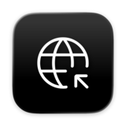

  

<h1 align="center">Portal</h1>

  Open every link in the browser where it belongs.

Portal is a quiet Mac app for people who live across more than one browser. It watches the links you open, matches them against your rules, and sends each one to the right place before the wrong browser gets in your way.

## Why Portal

Most browser switching tools ask you to choose every time. Portal is built for the opposite workflow: set your preferences once, then let links move automatically.

Use Safari for everyday browsing, Chrome for work apps, Arc for research, or a separate browser for a specific client. Portal keeps that shape intact without adding another decision to your day.

## What It Does

- Routes links by domain, so workspaces, dashboards, docs, and personal sites open where you expect.
- Understands the app that opened the link, so rules can respond to the source as well as the URL.
- Falls back to your preferred browser when no rule matches.
- Lives in the menu bar when you want quick access, and stays out of sight when you do not.
- Keeps routing local on your Mac.

## How It Feels

Create a rule once. The next time a matching link appears, Portal handles it before the browser choice becomes a distraction.

No picker dialogs. No copied URLs. No rearranging windows after a link lands in the wrong place.

## Download

Download the latest DMG from [Releases](https://github.com/zhangyu1818/Portal/releases/latest), drag Portal to Applications, and set it as your default browser when macOS asks.

## Built For

Portal is made for macOS and designed as a small, native utility: fast to open, easy to scan, and calm enough to leave running all day.
